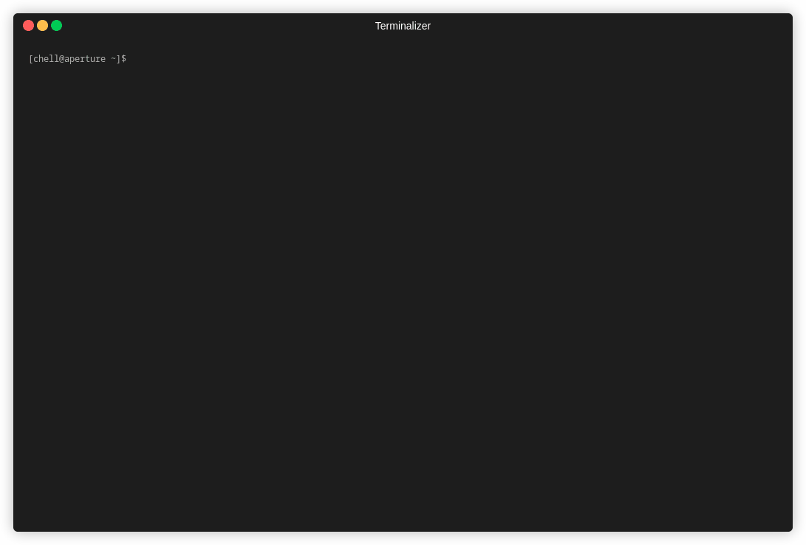

# scopehunter


scopehunter is a Python-based command-line tool that automates a full web reconnaissance workflow. It handles scope collection, expansion, host probing, URL harvesting, and vulnerability scanning in a single guided process.
The tool is designed to reduce repetitive setup work and keep reconnaissance structured and consistent for bug bounty or pentests.

## What It Does

- Optionally updates the system using a custom `update-all` script
- Collects scope interactively or reuses existing scope files
- Supports wildcard domains for subdomain discovery
- Expands scope using subfinder
- Probes live hosts and gathers metadata using httpx
- Exports hosts in Acunetix-compatible CSV format
- Collects historical URLs via the Wayback Machine (via `veybekci`)
- Executes Nuclei scans on discovered hosts

## Installation
Clone the repository:
```bash
git clone https://github.com/leitfader/scopehunter.git \
cd scopehunter \
```

## Disclaimer
This tool relies on `third-party tools` and public services. Availability, rate limits, and output accuracy depend on those external components.
Use responsibly and `only against systems you are authorized to test`.

## Honorable Mention
Also huge shotout to @projectdiscovery who has developed almost all of the tools in my usual recon toolchain. Don't forget to also check out his profile :)

